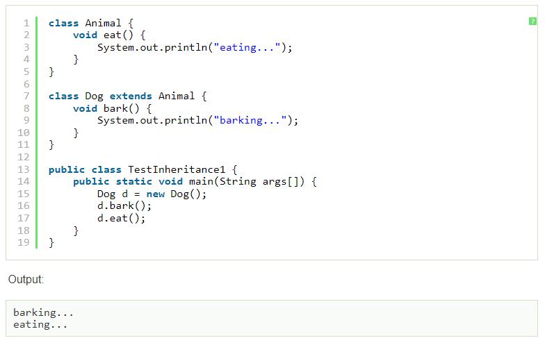
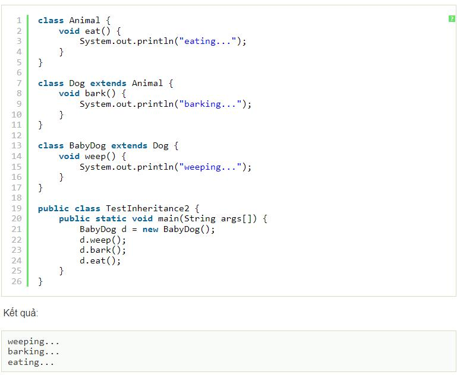
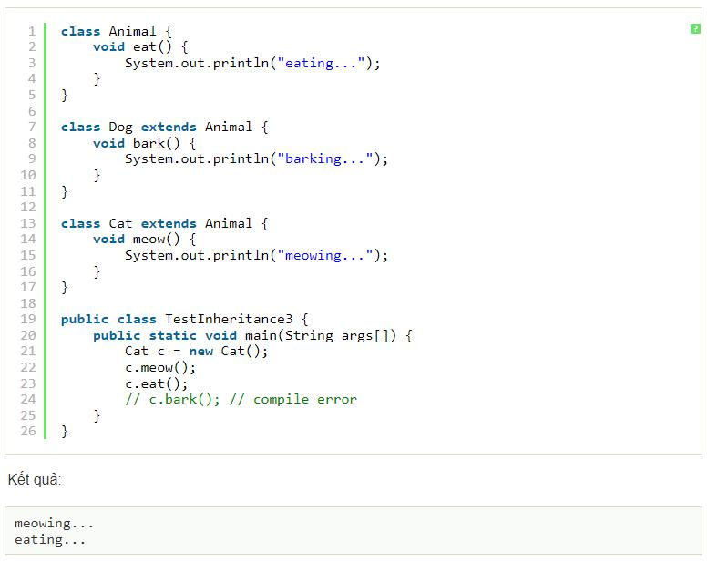
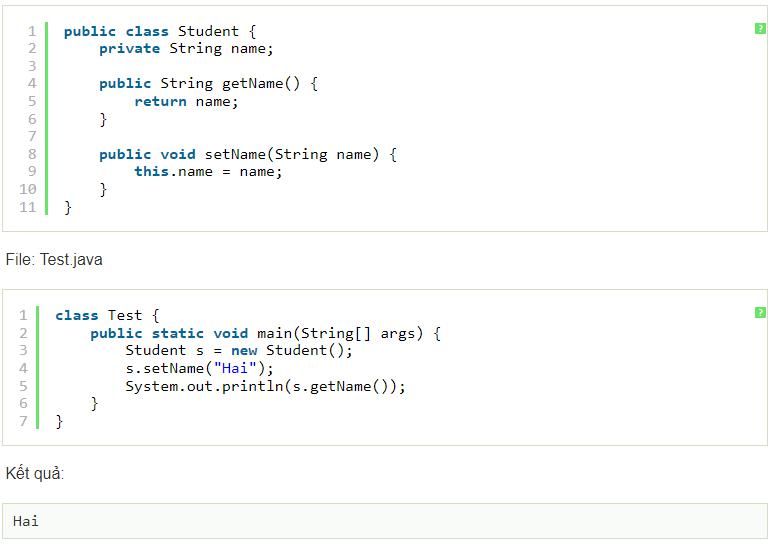
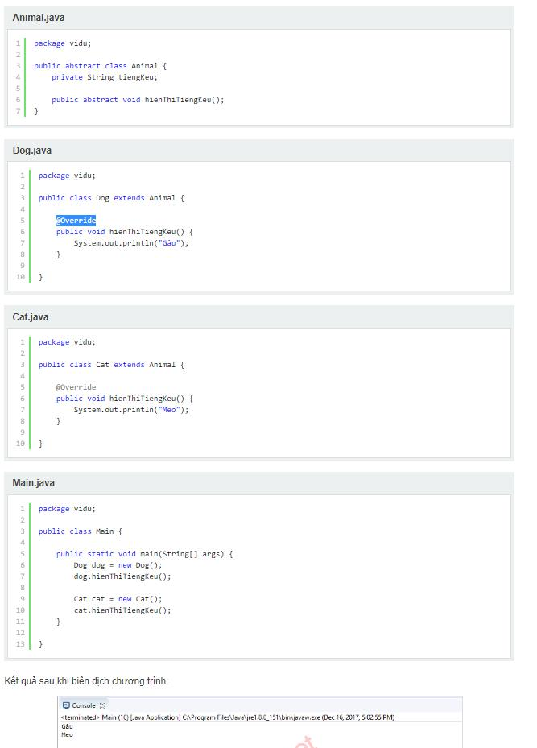
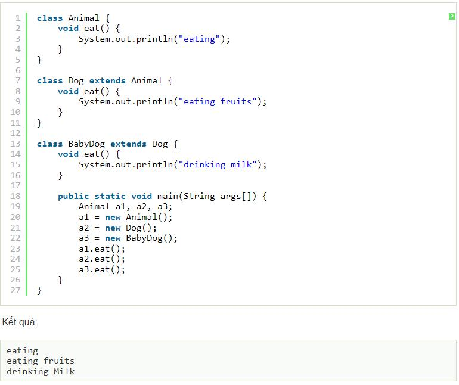
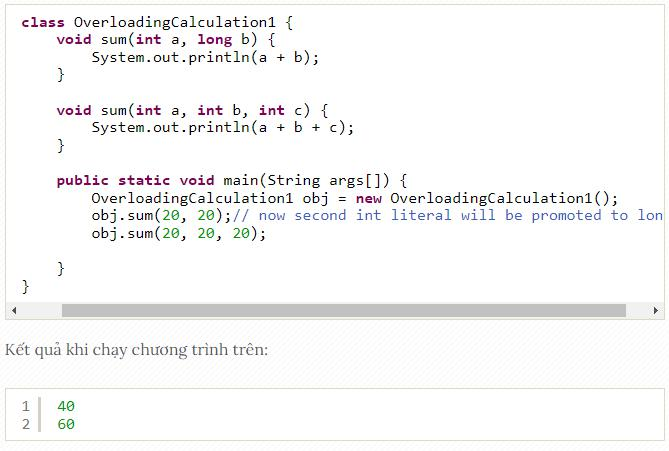

## 1. Java là gì
Java là một ngôn ngữ lập trình hiện đại, hướng đối tượng, bảo mật, mạnh mẽ.Java là ngôn ngữ phổ biến thế giới được phát triển bởi Sun Microsystems, được ra mắt năm 1995
Java hỗ trợ chạy trên rất nhiều nên tảng như: Windows,Mac OS,Linux...
 ## 2.OPP trong java (hướng đối tượng)
 - Trừu tượng
 - Kế thừa
 - Đa nhiệm
 - Đóng gói
 ## 3.Tính Kế Thừa trong java
 - là sự liên kết giữa class Cha và class Con,class Con extends class Cha sẽ được hưởng các phương thức hay thuộc tính của class Cha (ở dạng public,protected,ở dạng private thì không được truy cập)
 - có 3 dạng kế thừa: kế thừa đơn, kế thừa nhiều cấp, kế thừa thứ bậc
 - java hỗ trợ đa kế thừa kiểu interface
    + kế thừa đơn
    
    * kế thừa nhiều cấp
    
    * kế thừa thứ bậc
    
## 4.Tính Đóng gói trong java
- là kỹ thuật ẩn giấu thông tin không liên quan và hiện thị ra thông liên quan. Mục đích chính của đóng gói trong java là giảm thiểu mức độ phức tạp phát triển phần mềm.
    + Ví dụ về tính đóng gói
    
## 5.Tính Trừu Tượng trong java
- là kỹ thuật chỉ nêu tên vấn đề nhưng không thể hiện cụ thể,các phương thức chỉ khai báo tên chứ không có thân hàm(không có dấu {}).mục đích :Giao diện người dùng đơn giản,ẩn đoạn mã phức tạp,dễ dàng cập nhập,bảo trì
- class Cha chứa từ khóa "abstract", các phương thức phía trong có chứa từ khóa "abstract" sẽ không có thân hàm, class Con extends class Cha bắt buộc phải @Override các phương thức "abstract" trong class Cha
- ví dụ
    
## 6.Tính đa hình trong java
- là khái niệm mà ta thể hiện 1 hành động bằng nhiều cách khác nhau
- có 2 kiểu đa hình : biên dịch (compile) và thực thi (run time)
- Đa hình Thực Thi (run time) là kiểu class Con extends class Cha và ghi đề lại phương thức của Class Cha, khi gọi class Cha theo dữ liệu class Con thì khi chạy chương trình sẽ nhận Kết quả theo phương thức của Class con 
- Ví dụ Run Time
    
- Đa hình Biên dịch (compile) hay còn gọi là nạp chồng phương thức (method overloading) là kiểu 1 class có nhiều phương thức cùng tên nhưng khác dữ liệu truyền vào
- Ví dụ Compile
    
## 7.Có bao nhiêu exception
- Có 3 kiểu ngoại lệ : Checked , UnChecked, Error
-  Đối với Checked exception, việc kiểm tra được thực hiện ngay thời điểm compile time. Nếu không có đoạn code try-catch hoặc throws thì xảy ra lỗi Một số checked exception tiêu biểu như:
    + IOException (lỗi không tìm thấy file)
    * InterruptedException (lỗi không tìm thấy phương thức đang gọi)
    * XMLParseException.. 
- Còn đối với Unchecked exception, việc xác định có exception xảy ra hay không chỉ có thể thực hiện ở thời điểm runtime. Một số unchecked exception tiêu biểu là:  
    + NullPointerException (gọi phương thức từ 1 đối tượng bị null)
    + IndexOutOfBoundsException (gọi phương thức vướt quá số lượng mảng)
    + ClassCastException (ép kiểu lớp không hợp lệ)


## 8. Overriding (Ghi đè)  và Overloading (Nạp chồng)
- So Sánh

    

## 9.Sự khác nhau giữa Interface và Abstract
- Class abstract có các phương thức abstract và non-abstract. Trong khi Interface chỉ có phương thức abstract
- Class abstract có thể implement các Interface. Trong khi Interface thì không thể extends class abstract.
- Class Con chỉ được extends 1 class abstract Cha ,trong khi có thể implements nhiều interface
- Accessibility: các thành viên trong Interface kiếu mặc định là public. Trong khi class abstract thì lại có thể là private, protected,..
- Class Abstract thường dùng để hiện thị cấu trúc hoặc hướng dẫn cho 1 số class còn Interface thường dùng để hiện thị hành động chung của 1 số nhóm class
## 10. Bộ nhớ Head và Strack
- Bộ nhớ Heap và bộ nhớ Stack bản chất đều cùng là vùng nhớ được tạo ra và lưu trữ trong RAM khi chương trình được thực thi.
- Bộ nhớ Stack được dùng để lưu trữ các biến cục bộ trong hàm, tham số truyền vào... Truy cập vào bộ nhớ này rất nhanh và được thực thi khi chương trình được biên dịch.
- Bộ nhớ Heap được dùng để lưu trữ vùng nhớ cho những biến con trỏ được cấp phát động bởi các hàm malloc - calloc - realloc (trong C) hoặc từ khóa new (trong c++, c#, java,...).
- Kích thước vùng nhớ
    + Stack: kích thước của bộ nhớ Stack là cố định
    + Heap: kích thước của bộ nhớ Heap là không cố định
- Đặc điểm vùng nhớ
    + Stack: vùng nhớ Stack được quản lý bởi hệ điều hành, dữ liệu được lưu trong Stack sẽ tự động hủy khi hàm thực hiện xong công việc của mình.
    + Heap: Vùng nhớ Heap được quản lý bởi lập trình viên, dữ liệu trong Heap sẽ không bị hủy khi hàm thực hiện xong, phải tự tay hủy.
- Vấn đề lỗi xảy ra đối với vùng nhớ:
    + Stack: bởi vì bộ nhớ Stack cố định nên nếu chương trình bạn sử dụng quá nhiều bộ nhớ vượt quá khả năng lưu trữ của Stack chắc chắn sẽ xảy ra tình trạng tràn bộ nhớ Stack (Stack overflow), các trường hợp xảy ra như bạn khởi tạo quá nhiều biến cục bộ, hàm đệ quy vô hạn,...
    + Heap: Nếu bạn liên tục cấp phát vùng nhớ mà không giải phóng thì sẽ bị lỗi tràn vùng nhớ Heap (Heap overflow).
    + Nếu bạn khởi tạo một vùng nhớ quá lớn mà vùng nhớ Heap không thể lưu trữ một lần được sẽ bị lỗi khởi tạo vùng nhớ Heap thất bại.
## 11. Join trong SQL
- INNER JOIN (Hoặc JOIN)
- LEFT OUTER JOIN (Hoặc LEFT JOIN)
- RIGHT OUTER JOIN (Hoặc RIGHT JOIN)
- FULL OUTER JOIN (Hoặc OUTER JOIN)
- Ví Dụ Cấu Trúc Câu Lệnh:
    ```SQL
    Select * from lanptp.khach_hang as KH Join lanptp.order_kh as OD on KH.MaKH= OD.MaKH
    ```
    + Trong đó: 
        +   lanptp :tên data    
        +   khach_hang: table trái
        +   order_kh:  table phải

## 12. Cấu trúc câu lệnh Select trong SQL
- Cú pháp câu lệnh SELECT:
    ```SQL
    SELECT <tên cột | biểu thức> [ ,…]<br>
    [ FROM <tên bảng> [ ,…] ]<br>
    [ WHERE <điều kiện logic trên dòng / bộ> ]<br>
    [GROUP BY <các thuộc tính gom nhóm> ]<br>
    [HAVING <điều kiện logic gom nhóm> ]<br>
    [ ORDER BY <các thuộc tính sắp xếp> ]<br>
    ```
## 13. Spring IoC
- Spring container sử dụng DI để quản lý các thành phần, đối tượng để tạo nên 1 ứng dụng. Các thành phần, đối tượng này gọi là Spring Bean. Để tạo đối tượng, cấu hình, lắp rắp chúng, Spring Container sẽ đọc thông tin từ các file xml và thực thi chúng.
- Spring IoC có 2 loại:
    + BeanFactory
    + ApplicationContext
## 14. 

